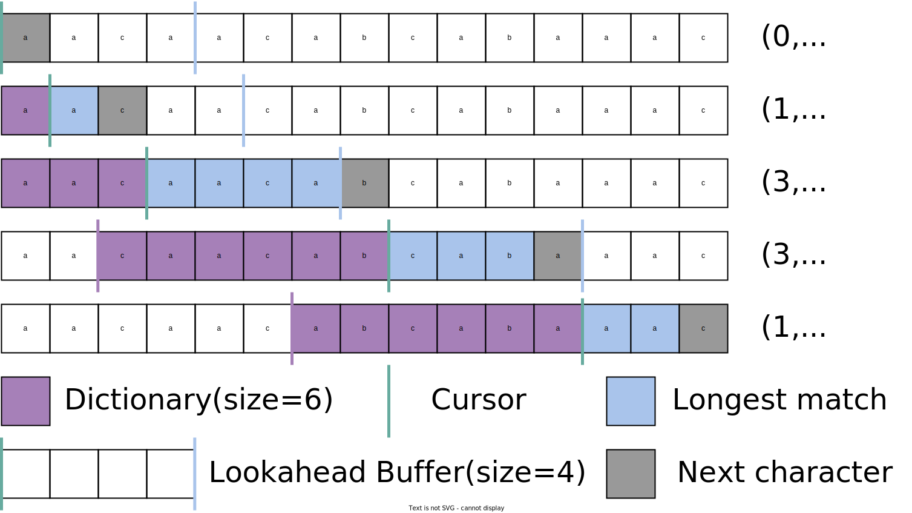

<!-- Playing God - Polyphia -->


## 引言

LZ77是一种采用字典进行数据压缩的经典压缩算法，由两位以色列工程师Jacob Ziv和Abraham Lempel在1977年发表的论文“A Universal Algorithm for Sequential Data Compression”中提出。

传统基于统计的压缩编码，如Huffman编码，需要得到先验信息——信源的字符频率，然后进行压缩。但是在大多数情况下，这种先验信息是很难预先获得的。因此，设计一种更为通用的数据压缩编码显得尤为重要，LZ77数据压缩算法应运而生，其核心思想是，利用数据的重复结构信息来进行数据压缩。即如果字符串中的信息在之前出现过，则只需要指出其之前出现过的位置，便可以用相对索引来表示这些词。

## 原理

这里仅讨论LZ77算法的压缩和解压缩过程，关于LZ77算法的唯一可译、无损压缩的性质，其数学证明参看原论文。

### 滑动窗口

首先，定义字符串$S$的长度为$N$，字符串$S$的子串$S_{ij},1\leq i,j \leq N$。对于前缀子串$S_{1,j}$，记$L_i^j$为首字符$S_i$的子串与首字符$S_{j+1}$的子串的最大匹配长度，即：
$$
L_i^j=\max\{l|S_{i,i+l-1}=S_{j+1,j+l}\},\quad l\leq N-j
$$
我们称字符串$S_{j+1,j+l}$匹配了字符串$S_{i,i+l-1}$，且匹配长度为$l$。如图所示，共有两种情况


定义$p^j$为所有情况下的最长匹配的起始位置$i$值，即

$$
p^i = \mathop{\arg\max}\limits_i\{L_i^j\}, \quad 1\leq i \leq j
$$
如对于字符串$S=00101011,j=3$则有
- $L_1^j=1\rightarrow S_{j+1,j+1}=S_{1,1},S_{j+1,j+2}\neq S_{1,2}$
- $L_2^j=4\rightarrow S_{j+1,j+1}=S_{2,2},S_{j+1,j+2}=S_{2,3},S_{j+1,j+3}=S_{2,4},S_{j+1,j+4}=S_{2,5},S_{j+1,j+5}\neq S_{2,6}$
- $L_3^j=0\rightarrow S_{j+1,j+1}\neq S_{3,3}$

因此，$p^j=2$且最长匹配的长度$l^j=4$。由此可知，子串$S_{j+1,j+p}$是可以由$S_{1,j}$生成的，因而称之为$S_{1,j}$的再生扩展（Reproducible Extension）。LZ77算法的核心思想便来源于此——用历史中出现过的字符串做字典，编码未来出现的字符，以达到数据压缩的目的。在具体实现中，用滑动窗口（Sliding Window）字典存储历史字符，Lookahead-Buffer存储待压缩的字符，Cursor作为两者之间的分隔，如图所示


并且字典与Lookahead Buffer的长度是固定的。

### 压缩

用$(p,l,c)$表示Lookahead Buffer中字符串的最长匹配结果，其中
- $p$表示最长匹配时，字典中字符开始时的位置（相对于Cursor位置）
- $l$为最长匹配字符串的长度
- $c$指Lookahead Buffer最长匹配结束时的下一字符

压缩的过程，就是重复输出$(p,l,c)$，并将Cursor移动至$l+1$，算法如下

```vb.net
Repeat:
	Output (p,l,c),
	Cursor --> l+1
Until to end of string
```

压缩示例如图所示



### 解压缩

为了能保证正确解码，解压缩时的滑动窗口与压缩时要相同。在解压缩时，遇到$(p,l,c)$大致分为三类情况：
- $p==0$且$l==0$，即初始情况，这时直接解码$c$
- $p\geq l$，解码为字典`dict[p:p+l+1]`
- $p<l$，即出现循环编码，则需要从左至右循环拼接，伪代码如下
```c
for (i = p, k = 0; k < length; i++, k++)
	out[cursor+k] = dict[i%cursor]
```
比如，`dict=abcd`，编码为`(2,9,e)`，则解压缩为`output=abcdcdcdcdcdce`。

## 实现

用matlab实现一个简单的LZ77压缩算法，由于我的目的主要时压缩数组，因此用数组代替字符串进行压缩设计和测试，具体实现如下

```matlab
classdef LZ77
% A simple implementation of LZ77 compression algorithm

    properties (SetAccess = private)
        window_size % dictionary
        buffer_size % lookahead buffer
    end

    methods
        function self = LZ77(d, h)
            if nargin == 2
                self.window_size = d;
                self.buffer_size = h;
            elseif nargin == 1
                self.window_size = d;
                self.buffer_size = 4;
            elseif nargin == 0
                self.window_size = 6;
                self.buffer_size = 4;
            end
        end

        function [p, l, c] = longest_match(self, data, cursor)
        % Find the longest match between dictionary and
        % lookahead-buffer.
        % 
        % arguments: (input)
        %   data    - data used to find longest match
        %   cursor  - position of data that seperate dictionary and 
        %             lookahead-buffer, from 0 to data length, value of
        %             cursor should be equal to its left item's index
        % arguments: (output)
        %   p - start point of longest match based on cursor
        %   l - length of longest match
        %   c - next character of longest match

            end_buffer = min(cursor + self.buffer_size, length(data)-1);

            p = -1;
            l = -1;
            c = '';

            for i = cursor+1:end_buffer
                start_index = max(1, cursor - self.window_size + 1);
                sub_string = data(cursor+1:i);
                subs_len = length(sub_string);

                for j = start_index:cursor
                    repetition = floor(subs_len / (cursor - j + 1));
                    last = rem(subs_len, (cursor - j + 1));
                    matched_string = [repmat(data(j:cursor), ...
                        [1 repetition]), data(j:j+last-1)];

                    % if match, update p, l, c
                    if isequal(matched_string, sub_string) && subs_len > l
                        p = cursor - j + 1;
                        l = subs_len;
                        c = data(i+1);
                    end
                end
            end

            % if not match, return next character of cursor
            if p == -1 && l == -1
                p = 0;
                l = 0;
                c = data(cursor + 1);
            end
        end

        function cm = compress(self, message)
        % Compress message
        % 
        % arguments: (input)
        %   message - data ready to compress
        % arguments: (output)
        %   cm      - compressed message
            
            i = 0;
            while i < length(message)
                [p, l, c] = self.longest_match(message, i);
                if exist('cm', 'var')
                    cm = [cm;[p,l,c]];
                else
                    cm = [p,l,c];
                end
                i = i + l + 1;
            end
        end

        function dm = decompress(self, cm)
        % Decompress the compressed message
        % 
        % arguments: (input)
        %   cm - compressed message
        % arguments: (output)
        %   dm - decompressed message

            cursor = 0;
            [n, ~] = size(cm);
            dm = [];

            for i = 1:n
                p = cm(i,1);
                l = cm(i,2);
                c = cm(i,3);
                if p == 0 && l == 0
                    dm = [dm, c];
                elseif p >= l
                    dm = [dm, dm(cursor - p + 1: cursor - p + l), c];
                elseif p < l
                    repetition = floor(l / p);
                    last = rem(l, p);
                    dm = [dm, repmat(dm(cursor-p+1:cursor), ...
                        [1 repetition]), dm(cursor-p+1:cursor-p+last), c];
                end
                cursor = cursor + l + 1;
            end
        end
    end
end
```

整体的编码解码逻辑清楚，解码过程中的循环匹配也较为简单。在寻找最大匹配子串中，前置子串采用了和循环匹配一样的生成方式，其实其他方式也是一样的，这里的生成方式不本质。

值得注意的是，在寻找最大匹配子串中时，Lookahead-Buffer是不能取到数据的最后一位的，即需要`length(data)-1`。这是因为如果Cursor后的数据全部匹配的话，这样匹配后的下一个字符索引会超出边界，而保证Lookahead-Buffer最多只到倒数第二个字符的话，能够保证就算在全部匹配之后还能够留有一个字符附在$(p,l,c)$中的$c$ 处，从而有效避免了数组越界的情况，同时压缩效率也没有下降。

```matlab
end_buffer = min(cursor + self.buffer_size, length(data)-1);
```

## 性能

在Dictionary和Lookahead-Buffer长度较小的时候，LZ77的压缩速度很快，但是压缩率很低，对于重复数据出现少的情况，甚至可能出现压缩后的数据比压缩之前还要大的情况。对于Dictionary和Lookahead-Buffer长度较小的情况，压缩效果较好，但是压缩速度很慢，且长度越大，压缩效果越好，压缩速度越慢。

对于Dictionary和Lookahead-Buffer长度均为80时，测试小天线的蓝盒子采集数据，压缩比约为1.29:1，压缩率为22%；扩大窗长度到200时，同样数据，压缩比约为1.49:1，压缩率为33%。

对于解压缩，由于和Dictionary和Lookahead-Buffer长度无关，因此解压缩速度均很快。

直接使用zip对2.29G的原始采集数据进行压缩，压缩比在3.35:1左右，由于也是基于LZ77算法的变种，性能相较直接的压缩有提升，但是整体数据量大也会导致压缩率的提升。

## 参考

- Ziv, Jacob, and Abraham Lempel. "A universal algorithm for sequential data compression." IEEE Transactions on information theory 23.3 (1977): 337-343.
- [LZ77算法原理及实现](https://www.cnblogs.com/en-heng/p/4992916.html)